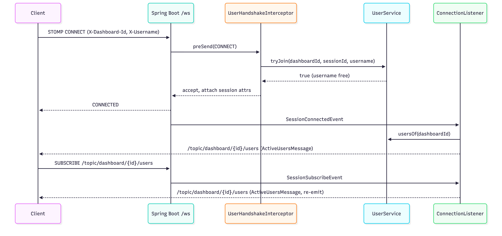
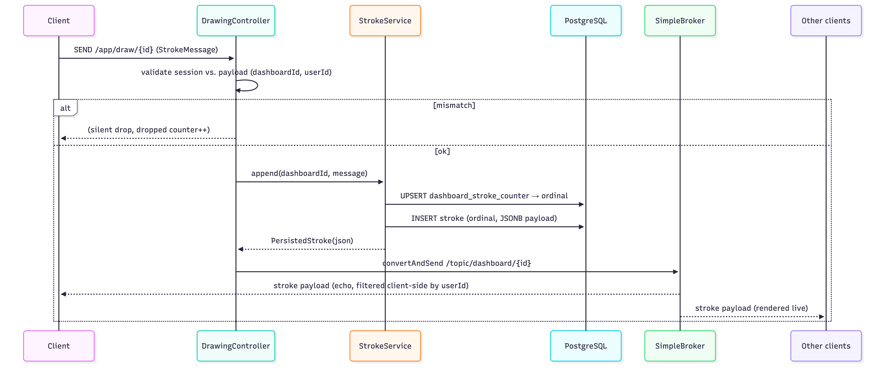
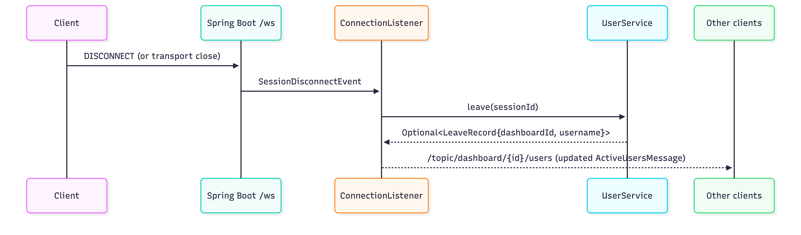
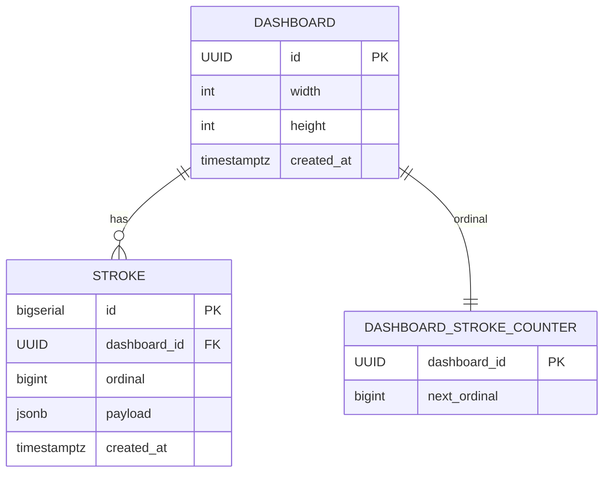
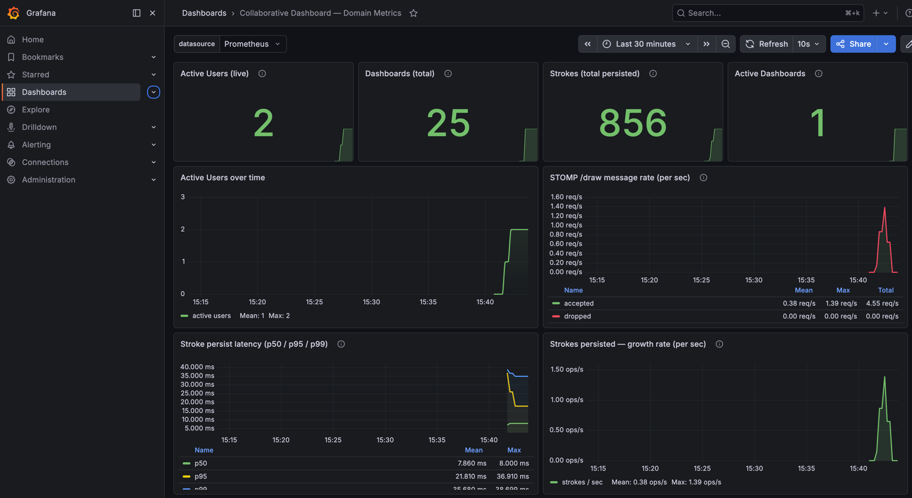

# Collaborative Dashboard System


> **Real-Time Collaborative Drawing Dashboard** — a Spring Boot 3.3 / Java 21 service where many users join a shared canvas over STOMP/WebSocket, draw strokes that are persisted to PostgreSQL, and see each other live via a presence channel. Observability is wired through Micrometer → Prometheus → Grafana.

```
       ┌──────────┐       STOMP/WS        ┌────────────────────┐       JDBC      ┌────────────┐
       │ Browser  │ ───── /ws (SockJS) ──▶│  Spring Boot :8081 │ ──────────────▶ │ PostgreSQL │
       │ (canvas) │ ◀── /topic/... ───────│  SimpleBroker      │                 │   :5432    │
       └──────────┘                       └─────────┬──────────┘                 └────────────┘
                                                    │ /actuator/prometheus
                                                    ▼
                                            ┌──────────────┐    ┌────────────┐
                                            │ Prometheus   │◀──▶│  Grafana   │
                                            │    :9090     │    │   :3000    │
                                            └──────────────┘    └────────────┘
```

---

## Table of Contents

- [Tech Stack](#tech-stack)
- [Features](#features)
- [WebSocket Message Broker](#websocket-message-broker)
- [STOMP Topics & Data Flow](#stomp-topics--data-flow)
- [Sequence Diagrams](#sequence-diagrams)
- [Database Schema](#database-schema)
- [Running with Docker Compose](#running-with-docker-compose)
- [Monitoring](#monitoring)
- [Scaling](#scaling)
- [Limitations](#limitations)
- [Build & Run](#build--run)
- [Ports Reference](#ports-reference)

---

## Tech Stack

| Area             | Technology                                  | Version        |
|------------------|---------------------------------------------|----------------|
| Language         | Java                                        | 21             |
| Framework        | Spring Boot (parent)                        | 3.3.4          |
|                  | Spring Web (REST)                           | (BOM-managed)  |
|                  | Spring WebSocket / STOMP                    | (BOM-managed)  |
|                  | Spring Validation                           | (BOM-managed)  |
|                  | Spring Data JPA / Hibernate                 | (BOM-managed)  |
|                  | Spring Boot Actuator                        | (BOM-managed)  |
| Persistence      | PostgreSQL                                  | 16 (alpine)    |
|                  | Flyway (schema migrations)                  | (BOM-managed)  |
| Observability    | Micrometer → Prometheus registry            | (BOM-managed)  |
|                  | Prometheus                                  | `latest`       |
|                  | Grafana OSS                                 | `latest`       |
| Build            | Maven                                       | 3.9+           |
| Tooling          | Lombok                                      | 1.18.40        |
|                  | Spring Boot DevTools                        | (BOM-managed)  |
| Infrastructure   | Docker Compose                              | —              |

Spring Boot 3.3.4 manages transitive versions for Spring Framework, Jackson, Hibernate, Micrometer, Flyway, JUnit Jupiter, and Mockito via its BOM.

---

## Features

### UI

Dashboard setup screen:

[Dashboard setup](docs/diagrams/ui/ui_dashboard_setup.png)

Live collaborative drawing:

[Dashboard drawing](docs/diagrams/ui/ui_dashboard_drawing.png)

### REST API (`DashboardController`)

| Method | Path                                  | Purpose                                          |
|--------|---------------------------------------|--------------------------------------------------|
| POST   | `/api/dashboards`                     | Create a new dashboard (width, height, username) |
| GET    | `/api/dashboards/{id}`                | Fetch dashboard metadata                         |
| GET    | `/api/dashboards/{id}/history`        | Stream all persisted strokes (ordered) as a JSON array |
| POST   | `/api/dashboards/{id}/clear`          | Wipe strokes, keep the dashboard                 |
| DELETE | `/api/dashboards/{id}`                | Delete dashboard (cascades strokes)              |

#### History streaming

`GET /api/dashboards/{id}/history` is not a bulk list — it's an **HTTP-streamed JSON array**. Knowing the contract matters for both sides:

- **Server** — `DashboardController#history` returns a `StreamingResponseBody`. `StrokeService#writeHistory` opens a JPA `Stream<Stroke>` (backed by a Postgres cursor) inside a read-only transaction and writes each persisted payload straight to the response `OutputStream`, framed as a JSON array: `[payload1,payload2,…,payloadN]`. The response body begins flushing as soon as the first row arrives from the DB; the server never materializes the full array on the heap, so a dashboard sitting at `HISTORY_MAX = 50 000` strokes no longer threatens process memory the way the previous `StringBuilder` implementation did.
- **Missing-dashboard handling** — before the stream starts, `DashboardService.get(id)` runs so a typo'd UUID returns a clean `404 Not Found` up front instead of an empty `[]` that looks like a cleared board.
- **Client** — `app.js` still reads the response with `res.json()` for simplicity (the server-side fix alone closes the DOS vector). The comment above `replayHistory` documents the drop-in path to incremental parsing (`ReadableStream` + NDJSON / oboe.js) if browser memory ever becomes a concern on very active boards.
- **Ordering & dedupe** — rows are emitted in strictly ascending `ordinal`. The client tracks `lastRenderedOrdinal` and skips anything it has already drawn, which is what lets the replay/live-buffer overlap in `onConnect` work correctly.
- **Bound** — `HISTORY_MAX` (50 000) still caps the stream. Beyond that, keyset pagination is the next step (see Scaling > Future improvements).

### WebSocket / STOMP

- **Endpoint**: `/ws` (SockJS fallback enabled)
- **Identity**: anonymous. Clients pass `X-Dashboard-Id` (UUID) and `X-Username` (1–32 chars) on the STOMP `CONNECT` frame. `UserHandshakeInterceptor` enforces a unique username per dashboard.
- **Live drawing**: strokes are batched client-side (~50 ms), sent over STOMP, assigned a monotonic per-dashboard ordinal, persisted, and broadcast to every subscriber.
- **Presence tracking**: a thread-safe in-memory `UserService` tracks `sessionId → username` per dashboard; the user list is rebroadcast on connect, subscribe, and disconnect.
- **Echo suppression**: the sender's `userId` is included in the broadcast payload so each client can skip its own strokes.
- **Observability**: custom Micrometer metrics for active users, active dashboards, stroke counts, message throughput, and stroke-persist latency.

---


## WebSocket Message Broker

Spring's **`WebSocketMessageBroker` is the heart of this system.** Every live interaction — stroke propagation, presence updates, the users list, echo suppression — flows through it. HTTP / REST is only used for dashboard metadata CRUD and history replay; the live, multi-user experience is entirely broker-driven.

### What the broker enables in the app

- **Many-to-many fan-out of strokes.** A single `convertAndSend` to `/topic/dashboard/{id}` is delivered to every subscribed client on that dashboard, with zero per-client bookkeeping in the app code.
- **Presence as a pub/sub topic.** The active users list is just another `/topic/dashboard/{id}/users` destination — clients subscribe once and receive updates on join, subscribe, and disconnect without polling.
- **Session-scoped identity.** STOMP gives every WebSocket connection a stable `sessionId` plus a per-session attribute map, so `dashboardId` and `username` are bound once at CONNECT and trusted on every subsequent frame.
- **Server-driven flow control.** Handler threads, client inbound/outbound channel pools, and the broker's own executor are separated — slow subscribers can't block producers.
- **Decoupled handlers.** `@MessageMapping` methods look like lightweight controllers; the broker itself is invisible to them apart from `SimpMessagingTemplate`.

### The STOMP protocol

**STOMP** (Simple/Streaming Text-Oriented Messaging Protocol) is a thin, text-based frame protocol carried over WebSocket. The app speaks STOMP 1.2 via `spring-boot-starter-websocket`.
STOMP provides a structured way to send and receive messages over WebSockets. Unlike raw WebSockets, which only deal with low-level message frames, STOMP introduces concepts like destinations, headers, and subscriptions, making it easier to work with real-time messaging. Spring Boot processes STOMP messages by routing them through controllers, handling subscriptions, and forwarding messages to connected clients. This section goes over how messages flow through the system, how destinations are resolved, and how Spring Boot processes incoming and outgoing STOMP frames.


Key frames used:

| Frame        | Direction       | Purpose in this app                                                        |
|--------------|-----------------|----------------------------------------------------------------------------|
| `CONNECT`    | client → server | Carries `X-Dashboard-Id` + `X-Username` native headers; identity handshake |
| `CONNECTED`  | server → client | Handshake accepted, session established                                    |
| `SUBSCRIBE`  | client → server | Client joins `/topic/dashboard/{id}` and `/topic/dashboard/{id}/users`     |
| `SEND`       | client → server | Stroke payload to `/app/draw/{id}`                                         |
| `MESSAGE`    | server → client | Broker fan-out of strokes and `ActiveUsersMessage`                         |
| `DISCONNECT` | client → server | Graceful close; triggers presence cleanup                                  |
| `ERROR`      | server → client | Handshake rejection (missing/invalid/duplicate identity) — session closes  |

Native headers on `CONNECT` are how identity travels — STOMP treats them as opaque strings, Spring surfaces them via `StompHeaderAccessor#getFirstNativeHeader`.

### WebSocket Configuration

The entire broker wiring lives in `WebSocketConfig.java` (annotated `@EnableWebSocketMessageBroker`) and does three things:

**1. Message broker (`configureMessageBroker`)**

```java
registry.enableSimpleBroker("/topic");
registry.setApplicationDestinationPrefixes("/app");
```

- `/topic` — in-memory **SimpleBroker** destinations. Server publishes here, subscribed clients receive. Pure pub/sub, no persistence, single JVM.
- `/app` — application destinations. Any frame SENT here is routed to a `@MessageMapping` handler (e.g. `DrawingController#draw`), never to the broker.
- The two prefixes are deliberately disjoint so clients can't "publish" directly into the broker and bypass validation.

**2. STOMP endpoint (`registerStompEndpoints`)**

```java
registry.addEndpoint("/ws")
        .setAllowedOriginPatterns(allowedOrigins.split(","))
        .withSockJS();
```

- `/ws` is the HTTP URL that upgrades to a WebSocket connection.
- `withSockJS()` enables the SockJS fallback chain (XHR-streaming, XHR-polling, etc.) for browsers or networks that block raw WebSocket.
- `allowedOrigins` is sourced from `app.websocket.allowed-origins` (default `*` for dev — **set explicitly in production**).

**3. Inbound channel interceptor (`configureClientInboundChannel`)**

```java
registration.interceptors(userHandshakeInterceptor);
```

Every inbound STOMP frame passes through `UserHandshakeInterceptor#preSend` before reaching a handler. The interceptor inspects only `CONNECT` frames and lets everything else through unchanged — that is where the handshake logic lives.

### WebSocket Handshake Process

The handshake is two-phase: the **HTTP upgrade** happens first at the servlet layer, then the **STOMP CONNECT handshake** establishes identity at the messaging layer.

1. **HTTP → WebSocket upgrade.** Client issues `GET /ws` (or a SockJS equivalent) with `Upgrade: websocket`. Spring negotiates the upgrade; the `allowedOriginPatterns` list decides whether the origin is accepted.
2. **STOMP `CONNECT` frame.** The client sends a `CONNECT` frame immediately after the socket opens, carrying two native headers:
   - `X-Dashboard-Id` — UUID of the dashboard being joined
   - `X-Username` — 1..32 chars matching `[A-Za-z0-9 _.\-]`
3. **`UserHandshakeInterceptor.preSend`.** The interceptor intercepts this frame and runs four checks in order:
   - headers present (else: `missing_identity_headers`)
   - `X-Dashboard-Id` parses as a UUID (else: `invalid_dashboard_id`)
   - `X-Username` matches the pattern (else: `invalid_username`)
   - `UserService.tryJoin(dashboardId, sessionId, username)` succeeds — atomic per-dashboard uniqueness check (else: `username_taken`)
4. **Identity is pinned to the session.** On success, `dashboardId` and `username` are written into the STOMP session attributes (`ATTR_DASHBOARD_ID`, `ATTR_USERNAME`). Every later frame from this session can be trusted without re-parsing headers or re-querying the registry.
5. **`CONNECTED` frame is returned.** The client now subscribes to `/topic/dashboard/{id}` and `/topic/dashboard/{id}/users`.
6. **Presence broadcast.** `ConnectionListener` reacts to `SessionConnectedEvent` **and** `SessionSubscribeEvent` by sending an `ActiveUsersMessage` on the users topic — the re-emit on SUBSCRIBE is deliberate, to avoid racing the client's subscribe frame (and essential once the broker is replaced by a RabbitMQ relay with cross-node latency).
7. **Failure path.** Any rejection throws `MessageDeliveryException`; Spring turns that into a STOMP `ERROR` frame, the client sees the reason code, and the WebSocket is closed. No partial state is left in the presence registry because `tryJoin` only records on success.

### WebSocket Message Handling

Once the WebSocket connection is established, messages are exchanged using STOMP. The framework relies on `SimpleBrokerMessageHandler` to route messages between clients. Messages travel through an internal queue before reaching their destination.

Spring Boot maintains a mapping between active WebSocket sessions and connected clients. Each WebSocket session has a unique identifier, which allows the server to track subscriptions and direct messages efficiently. The `SimpMessagingTemplate` class is used internally to send messages to specific users or broadcast to all subscribers.

In this app:

- `SimpleBrokerMessageHandler` (activated by `enableSimpleBroker("/topic")`) holds the in-JVM subscription registry and pushes `MESSAGE` frames out to every matching subscriber when something is published to a `/topic/...` destination.
- Each STOMP session's `sessionId` is the key that ties an open WebSocket to its subscriptions; `UserHandshakeInterceptor` pins `dashboardId` + `username` onto that session's attribute map at CONNECT time so the server never has to re-identify the client.
- `DrawingController` injects `SimpMessagingTemplate` and calls `convertAndSend("/topic/dashboard/{id}", ...)` after a stroke is persisted — the template serializes the payload (Jackson) and hands it to the broker, which fans it out to every subscriber on that dashboard.
- `ConnectionListener` uses the same `SimpMessagingTemplate` to publish `ActiveUsersMessage` to `/topic/dashboard/{id}/users` on connect, subscribe, and disconnect events.
- Inbound and outbound traffic flow through Spring's client inbound/outbound executor channels, so broker dispatch never runs on the WebSocket I/O thread and a slow subscriber cannot back-pressure producers.

---

## STOMP Topics & Data Flow

The STOMP broker is the **in-memory SimpleBroker** (single JVM) with:
- **Application prefix** `/app` → routes to `@MessageMapping` handlers
- **Broker prefix** `/topic` → server → client fan-out

### Inbound destinations (client → server, prefix `/app`)

| Destination                       | Handler                  | Payload (`StrokeMessage`)                                                                 | Notes                                                                                                |
|-----------------------------------|--------------------------|-------------------------------------------------------------------------------------------|------------------------------------------------------------------------------------------------------|
| `/app/draw/{dashboardId}`         | `DrawingController.draw` | `{ dashboardId: UUID, userId: String(1..64), points: [{x, y}] (1..512), color?, thickness? }` | Must match session's bound `dashboardId` **and** `userId`, otherwise the message is dropped (counter: `dashboard.stomp.messages{outcome="dropped"}`). |

### Outbound destinations (server → client, prefix `/topic`)

| Destination                               | Producer             | Payload                                                                                                     | When emitted                                                                 |
|-------------------------------------------|----------------------|-------------------------------------------------------------------------------------------------------------|------------------------------------------------------------------------------|
| `/topic/dashboard/{dashboardId}`          | `DrawingController`  | Persisted stroke JSON: `{ dashboardId, userId, points, color, thickness, ordinal, createdAt }`              | After a stroke is accepted and persisted. Ordinal is monotonic per dashboard. |
| `/topic/dashboard/{dashboardId}/users`    | `ConnectionListener` | `ActiveUsersMessage { dashboardId: UUID, users: String[] (sorted) }`                                        | On `SessionConnectedEvent`, `SessionSubscribeEvent` (for this topic), and `SessionDisconnectEvent`. |

### STOMP headers (CONNECT frame)

| Header            | Required | Format                                   | Purpose                                                   |
|-------------------|----------|------------------------------------------|-----------------------------------------------------------|
| `X-Dashboard-Id`  | yes      | UUID                                     | Binds session to a single dashboard                       |
| `X-Username`      | yes      | 1..32 chars `[A-Za-z0-9 _.\-]`           | Display name, unique per dashboard (rejected if taken)    |

> The connect-time users broadcast is also re-emitted on SUBSCRIBE to avoid racing the client's subscribe frame — useful now, essential the moment a RabbitMQ relay is added.

---

## Sequence Diagrams

### Joining a dashboard and receiving the current user list



### Drawing a stroke



### Leaving



---

## Database Schema



Ordinals are reserved atomically via an `INSERT ... ON CONFLICT DO UPDATE RETURNING` on `dashboard_stroke_counter`, then the stroke row is inserted with that ordinal — guaranteeing a global per-dashboard order without table-level locks.

---

## Running with Docker Compose

`docker-compose.yml` provisions the **infrastructure** (PostgreSQL, Prometheus, Grafana). The Spring Boot app itself is run from your IDE or `mvn spring-boot:run` against these services.

| Service      | Image                         | Host → Container | Volumes                                                                                                                                                 | Key env / notes                                                                                   |
|--------------|-------------------------------|------------------|---------------------------------------------------------------------------------------------------------------------------------------------------------|---------------------------------------------------------------------------------------------------|
| `postgres`   | `postgres:16-alpine`          | `5432 → 5432`    | `pgdata:/var/lib/postgresql/data`                                                                                                                       | `POSTGRES_DB=dashboard`, `POSTGRES_USER=dashboard`, `POSTGRES_PASSWORD=dashboard`                 |
| `prometheus` | `prom/prometheus:latest`      | `9090 → 9090`    | `./monitoring/prometheus.yml:/etc/prometheus/prometheus.yml:ro`, `prometheus-data:/prometheus`                                                          | `extra_hosts: host.docker.internal:host-gateway` so Prometheus can scrape the host-run Spring app |
| `grafana`    | `grafana/grafana-oss:latest`  | `3000 → 3000`    | `grafana-data:/var/lib/grafana`, `./monitoring/grafana/provisioning/datasources:ro`, `./monitoring/grafana/provisioning/dashboards:ro`                  | `GF_SECURITY_ADMIN_USER=admin`, `GF_SECURITY_ADMIN_PASSWORD=admin`, `GF_USERS_ALLOW_SIGN_UP=false`, depends on `prometheus` |

```bash
docker compose up -d prometheus grafana
mvn spring-boot:run    # in another terminal
open http://localhost:8081
open http://localhost:3000    # Grafana (admin / admin)
```

---

## Monitoring

Metrics are exported via Micrometer at `/actuator/prometheus` and scraped every 15 s.

### Scrape configuration (`monitoring/prometheus.yml`)

```yaml
global:
  scrape_interval: 15s
  evaluation_interval: 15s
scrape_configs:
  - job_name: collaborative-dashboard
    static_configs:
      - targets: ['host.docker.internal:8081']
    metrics_path: /actuator/prometheus
```

> The `application` label is **not** set at the Prometheus job level — Micrometer already tags it (`management.metrics.tags.application=collaborative-dashboard-system`). Duplicating it would create an `exported_application` label and break stock dashboards (4701, 11378).

### Custom domain metrics

| Metric                             | Type    | Labels         | Meaning                                          |
|------------------------------------|---------|----------------|--------------------------------------------------|
| `dashboard_count`                  | Gauge   | —              | Total dashboards in the DB                       |
| `dashboard_strokes_count`          | Gauge   | —              | Total persisted strokes across all dashboards    |
| `dashboard_active_users`           | Gauge   | —              | Currently-connected sessions                     |
| `dashboard_active_dashboards`      | Gauge   | —              | Dashboards with at least one connected user      |
| `dashboard_stomp_messages_total`   | Counter | `outcome`      | `accepted` / `dropped` (validation failures)     |
| `dashboard_stroke_persist_seconds` | Timer   | (percentiles)  | p50/p95/p99 persist latency                      |

> Gauges intentionally do **not** end in `.total` — that suffix is reserved by Prometheus conventions for counters, and gauges named that way silently render as "No data" in Grafana.

### Dashboards

- **Custom**: `monitoring/grafana/provisioning/dashboards/collaborative-dashboard.json` — UID `collab-dash-domain`, refresh 10 s, default window 30 min.
  - Active Users (live) — stat w/ thresholds 50/200
  - Dashboards (total)
  - Strokes (total persisted)
  - Active Dashboards
  - Active Users over time (time series)
  - STOMP `/draw` message rate split by `outcome` (accepted green / dropped red)
  - Stroke persist latency p50/p95/p99
- **Datasource**: provisioned Prometheus at `http://prometheus:9090`.



No alerting rules are currently shipped.

---

## Scaling

### Current limits (single-instance only)

- **SimpleBroker is in-JVM.** Subscribers on node A will not see strokes published to node B. `/topic/...` does not fan out across processes.
- **`UserService` is in-memory.** Presence state is not shared; each node reports only its own sessions. Restarts drop all presence.
- **Custom gauges are JVM-local.** Prometheus would scrape each instance independently; you'd aggregate with `sum(...)` in PromQL.
- **History endpoint is streamed but not paginated** (hard cap 50 000). `/api/dashboards/{id}/history` uses `StreamingResponseBody` + a JPA cursor so rows flow straight from Postgres into the HTTP response without ever being fully materialized server-side — heap stays flat even for boards near the cap. The client still parses the full array in `replayHistory` (see `static/app.js`), so incremental parsing on the browser side is a future optimization; for true unbounded boards, keyset pagination is still needed.

### Already scale-friendly

- Controllers are stateless; session binding lives in STOMP session attributes, not in singletons.
- PostgreSQL is the source of truth — any instance can serve `/history` and accept new strokes.
- Ordinal assignment is atomic at the DB layer (UPSERT `RETURNING`), so multiple instances can safely persist in parallel today.
- Metrics and tags are instance-agnostic; adding replicas is a matter of a second scrape target.

### Future improvements

**1. RabbitMQ STOMP relay** — replace `enableSimpleBroker("/topic")` with `enableStompBrokerRelay("/topic")` pointing at Rabbit on `61613` (plus management at `15672`, AMQP at `5672`). This fans `/topic/dashboard/{id}` out across every Spring Boot instance so a stroke accepted on any node reaches all subscribers everywhere.

```
              ┌──────────┐         ┌──────────┐
              │  app-1   │         │  app-2   │
              └────┬─────┘         └─────┬────┘
                   │  STOMP relay :61613 │
                   └──────────┬──────────┘
                              ▼
                       ┌─────────────┐
                       │  RabbitMQ   │   (management :15672)
                       └─────────────┘
```

**2. Redis for presence** — introduce a `PresenceBackend` interface (the refactor already exists on a feature branch as of 2026-04-19; main still uses the in-memory `UserService`). The Redis implementation uses `SADD` + a tiny Lua script for atomic join / leave, with `SUBSCRIBE`-backed change notifications. This makes active-user counts and the users topic correct across the fleet.

**3. History pagination** — `/history` already streams the response body via `StreamingResponseBody` over a JPA cursor, so the server never buffers the full 50 000-row payload on the heap. The remaining gap is on the wire and on the client: the response is still a single unbounded JSON array, and `app.js` parses it with `res.json()`. Replacing it with keyset-paginated pages (or a length-delimited NDJSON stream the browser can incrementally parse) is the next step for boards that grow beyond the cap.

**4. Sticky sessions / session resumption** — add a `PING`/heartbeat-tolerant STOMP configuration and optionally a short-lived `SESSION-ID` cookie so a dropped socket can rejoin without losing its slot in the presence registry.

---

## Limitations

Documented in `report/audit-report.md`; summarized here.

### Security / correctness

- **No authentication.** `userId` is a client-supplied display name. Accepting it on trust is intentional but means impersonation is possible from any origin.
- **CORS wildcard by default.** `app.websocket.allowed-origins=*` and the REST controller's `@CrossOrigin` default to any origin — set this explicitly in production.
- **Unvalidated `color` / `thickness`.** Both fields on `StrokeMessage` are persisted verbatim as JSONB; an unbounded string could land in the DB.
- **`GET /api/dashboards/{id}` returns 500 on missing.** Raises `IllegalArgumentException`; should return 404.
- **No rate limiting.** Neither `/app/draw/*` nor the REST endpoints have per-user quotas.

### Operations

- **In-memory presence is lost on restart.** Everyone is kicked and must reconnect.
- **Single-instance broker.** Horizontal scaling requires the Rabbit relay described above.
- **Dropped STOMP messages are silently discarded** (only the `outcome=dropped` counter moves). There are no warn logs or per-session diagnostics.

---

## Build & Run

Requirements: **JDK 21**, **Maven 3.9+**, **Docker** (for infra).

```bash
# 1. Start infrastructure
docker compose up -d

# 2. Build
mvn clean install

# 3. Run the app
mvn spring-boot:run
# or
java -jar target/collaborative-dashboard-system-0.0.1-SNAPSHOT.jar

# 4. Open
open http://localhost:8081      # the dashboard app
open http://localhost:3000      # Grafana (admin / admin)
open http://localhost:9090      # Prometheus
```


## Ports Reference

| Port  | Component      | Protocol     | Purpose                                    |
|-------|----------------|--------------|--------------------------------------------|
| 8081  | Spring Boot    | HTTP + WS    | REST API, `/ws` STOMP endpoint, actuator   |
| 5432  | PostgreSQL     | TCP          | Persistence                                |
| 9090  | Prometheus     | HTTP         | Scrape UI, query API                       |
| 3000  | Grafana        | HTTP         | Dashboards UI (admin / admin)              |

All are bound on the host by `docker-compose.yml` except 8081, which the Spring Boot app binds itself.
